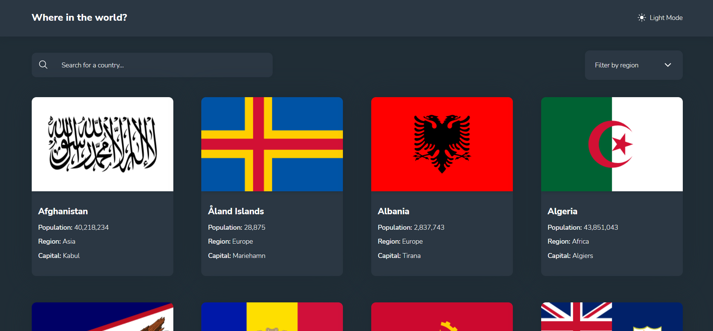
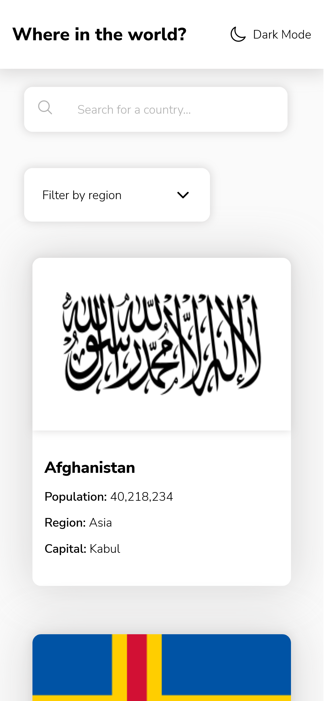

# Frontend Mentor - REST Countries API with color theme switcher

This is a solution to the [REST Countries API with color theme switcher challenge on Frontend Mentor](https://www.frontendmentor.io/challenges/rest-countries-api-with-color-theme-switcher-5cacc469fec04111f7b848ca). Frontend Mentor challenges help you improve your coding skills by building realistic projects.

## Table of contents

- [Frontend Mentor - REST Countries API with color theme switcher](#frontend-mentor---rest-countries-api-with-color-theme-switcher)
  - [Table of contents](#table-of-contents)
  - [Overview](#overview)
    - [The challenge](#the-challenge)
    - [Screenshots](#screenshots)
      - [Home Page - Light theme](#home-page---light-theme)
    - [Links](#links)
  - [My process](#my-process)
    - [Built with](#built-with)
  - [Author](#author)

## Overview

### The challenge

Users should be able to:

- See all countries from the API on the homepage
- Search for a country using an input field
- Filter countries by region
- Click on a country to see more detailed information on a separate page
- Click through to the border countries on the detail page
- Toggle the color theme between light and dark mode

### Screenshots

#### Home Page - Light theme

Desktop screenshot

Mobile screenshot

### Links

- Solution URL : [countries](https://baptajck.github.io/countries/)

## My process

### Built with

- Semantic HTML5 markup
- SCSS custom properties
- Flexbox
- Mobile-first workflow
- [ReactJS](https://reactjs.org/) library
- ViteJS

## Author

- Website - [Axurynn](https://baptjack.fr)
- Frontend Mentor - [@axurynn](https://www.frontendmentor.io/profile/Baptajck)

